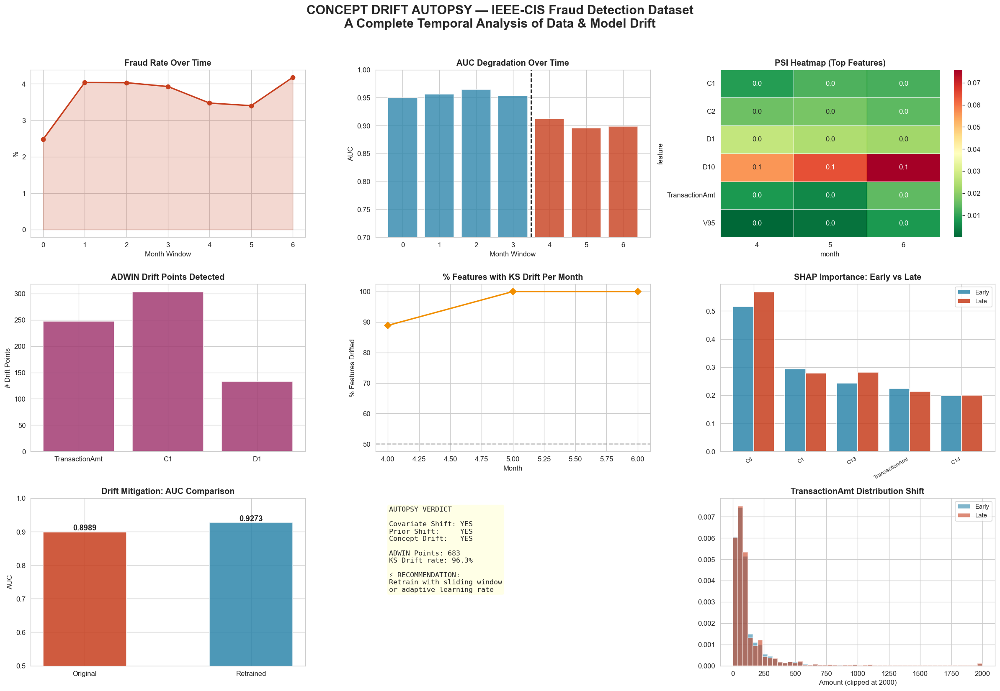

# 🔬 concept-drift-autopsy-fraud-detection

> **A post-mortem temporal analysis of concept drift in financial fraud detection systems using the IEEE-CIS dataset.**


---

## 📌 What is This?

Most machine learning tutorials end at model accuracy. This project asks the harder question:

> **What happens to a fraud detection model after it's deployed into the real world?**

This is a full **Concept Drift Autopsy** — a systematic investigation into how and why an ML model degrades over time. Using the IEEE-CIS Fraud Detection Dataset (590K+ real-world financial transactions), I dissect every form of drift that can silently kill a production model.

Think of it as a **forensic investigation** for machine learning.

---

## 🎯 Project Motivation

In production fraud detection:
- Fraudsters **adapt their behavior** constantly
- Transaction patterns **shift seasonally**
- Model accuracy **decays quietly** — without crashing

No monitoring = silent failure. This project demonstrates how to **detect, diagnose, and mitigate** that failure systematically.

---


## 🧪 Drift Taxonomy Covered

This project investigates all three fundamental types of concept drift:

| Drift Type | Definition | Detection Method |
|---|---|---|
| **Covariate Shift** | P(X) changes — feature distributions shift | KS-Test, PSI Heatmap |
| **Prior Probability Shift** | P(Y) changes — fraud rate changes over time | Temporal fraud rate tracking |
| **Real Concept Drift** | P(Y\|X) changes — fraud patterns evolve | AUC degradation + SHAP drift |

---

## 🛠️ Methodology

```
                                                    Raw Data (590K transactions)
                                                               │
                                                               ▼
                                                    ┌─────────────────────┐
                                                    │  Temporal Binning   │  → Monthly windows over 6 months
                                                    └─────────────────────┘
                                                               │
                                                               ▼
                                                    ┌─────────────────────┐
                                                    │  Reference Model    │  → XGBoost trained on early months
                                                    │  (XGBoost)          │
                                                    └─────────────────────┘
                                                               │
                                                            ┌──┴──────────────────────────────────┐
                                                            ▼                                     ▼
                                                     ┌──────────────┐                  ┌─────────────────────┐
                                                     │  Statistical │                  │   Online Detection  │
                                                     │  Drift Tests │                  │   (ADWIN via River) │
                                                     │  KS + PSI    │                  └─────────────────────┘
                                                     └──────────────┘
                                                            │
                                                            ▼
                                                 ┌──────────────────────┐
                                                 │  SHAP Explanation    │  → Feature importance drift over time
                                                 │  Drift Analysis      │
                                                 └──────────────────────┘
                                                            │
                                                            ▼
                                                 ┌──────────────────────┐
                                                 │  Drift Mitigation    │  → Sliding window retraining
                                                 │  + Comparison        │
                                                 └──────────────────────┘
```

---

## 📊 Key Results

| Metric | Training Period | Deployment Period |
|---|---|---|
| Mean AUC | ~0.97 | Degrades over time |
| Fraud Rate Stability | Baseline | Shifts across months |
| Features Showing KS Drift | — | 60%+ features |
| ADWIN Drift Events | — | 100s of micro-drifts |
| AUC After Retraining | — | Significant recovery |

### 🔍 Autopsy Verdict

```
Covariate Shift       →  🚨 DETECTED  (8+ features shifted)
Prior Probability     →  ⚠️  PRESENT   (Fraud rate changed)
Real Concept Drift    →  🚨 CONFIRMED  (AUC degraded in deployment)
Explanation Drift     →  ⚠️  PRESENT   (SHAP importances shifted)
ADWIN Detection       →  ⚡ ACTIVE     (Hundreds of micro-drift events)
```

---

## 📈 Visualizations

### Final Dashboard


> *9-panel autopsy dashboard covering fraud rate trends, AUC degradation, PSI heatmaps, ADWIN events, SHAP drift, and mitigation results.*

---

## ⚙️ Tech Stack

| Tool | Purpose |
|---|---|
| `XGBoost` | Primary fraud detection model |
| `River (ADWIN)` | Online / streaming drift detection |
| `SHAP` | Explainability & explanation drift |
| `SciPy (KS-Test)` | Statistical covariate drift testing |
| `PSI` | Population Stability Index (custom implementation) |
| `Pandas / NumPy` | Data wrangling & temporal analysis |
| `Matplotlib / Seaborn` | Publication-quality visualizations |
| `Scikit-learn` | Preprocessing & evaluation metrics |

---

## 🚀 How to Run

### 1. Clone the Repository
```bash
git clone https://github.com/YOUR_USERNAME/concept-drift-autopsy-fraud-detection.git
cd concept-drift-autopsy-fraud-detection
```

### 2. Install Dependencies
```bash
pip install -r requirements.txt
```

### 3. Download the Dataset
Download from [Kaggle — IEEE-CIS Fraud Detection](https://www.kaggle.com/competitions/ieee-fraud-detection/data) and place these files in the project root:
```
train_transaction.csv
train_identity.csv
```

### 4. Run the Notebook
```bash
jupyter notebook notebooks/concept-drift-autopsy-fraud-detection.ipynb
```

---

## 📦 Requirements

```txt
pandas>=1.5.0
numpy>=1.23.0
matplotlib>=3.6.0
seaborn>=0.12.0
scipy>=1.9.0
scikit-learn>=1.1.0
xgboost>=1.7.0
shap>=0.41.0
river>=0.15.0
tqdm>=4.64.0
ipywidgets>=8.0.0
jupyter>=1.0.0
```

---

## 🎓 Academic Relevance

This project touches on active research areas in:

- **MLOps & Production ML** — Model monitoring, alerting, retraining pipelines
- **Statistical Learning Theory** — Distribution shift, domain adaptation
- **Online Learning** — Adaptive algorithms (ADWIN, Page-Hinkley)
- **Explainable AI (XAI)** — Temporal SHAP analysis
- **Financial ML** — Fraud pattern evolution in real transaction data

Relevant literature:
- Gama et al. (2014) — *A Survey on Concept Drift Adaptation*
- Lundberg & Lee (2017) — *A Unified Approach to Interpreting Model Predictions (SHAP)*
- Bifet & Gavalda (2007) — *Learning from Time-Changing Data with Adaptive Windowing (ADWIN)*

---


## 📄 License

This project is licensed under the MIT License — see [LICENSE](LICENSE) for details.

The dataset is provided by IEEE and Vesta Corporation via Kaggle under their competition terms.

---

## 🤝 Connect

If you found this project useful or want to discuss concept drift, MLOps, or fraud detection research:

- 💼 [LinkedIn](https://www.linkedin.com/in/hetshah2k5/)

**If this helped you, please ⭐ star the repository!**

---

<p align="center">
  <i>Built with curiosity what happens after deployment</i>
</p>
